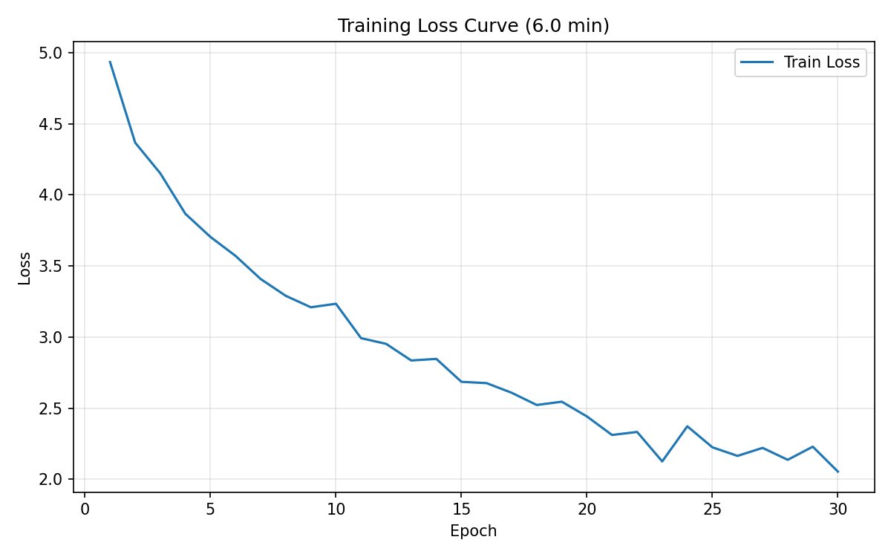
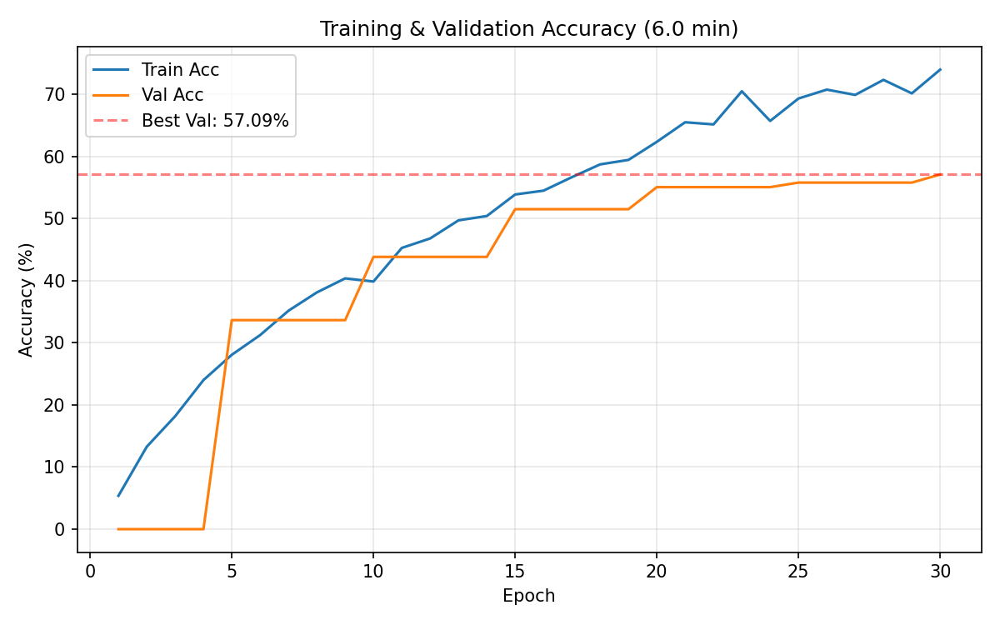
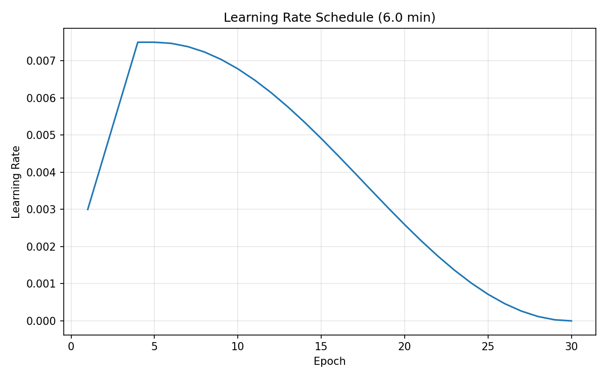

# Coding Project 2 — Tiny ImageNet Image Classification

**Name:** Pan Changxun | **Student ID:** 2024011323

---

## 1. Generative AI Usage Disclosure

Used Claude (AI assistant by Anthropic) in the following capacities:

- **Architecture design:** Brainstorming model architecture choices (SE-ResNet vs. plain ResNet vs. VGG-style) and adapting ResNet for 64x64 input.
- **Training strategy:** Discussing hyperparameter selection, data augmentation pipeline, and regularization techniques (Mixup, label smoothing).
- **Code review:** Reviewing implementation for correctness and PyTorch best practices.
- **Report writing:** Polishing English grammar and formatting.

All code was written, tested, and verified by the author.

---

## 2. Architecture Details

### Overview: SE-ResNet-18

The model is a ResNet-18 variant with **Squeeze-and-Excitation (SE)** channel attention, adapted for 64x64 input. Total parameters: **11,395,464 (~11.4M)**.

### Architecture Diagram

```
Input (B, 3, 64, 64)
 │
 ▼ ═══════════════ Stem ═══════════════
 │  Conv2d(3→64, 3x3) → BN → ReLU
 │  Conv2d(64→64, 3x3) → BN → ReLU
 │  MaxPool2d(2x2, stride=2)
 │                                        (B, 64, 32, 32)
 ▼ ═══════════════ Layer 1 ═════════════
 │  BasicBlock(64→64)  x2                 no downsampling
 │                                        (B, 64, 32, 32)
 ▼ ═══════════════ Layer 2 ═════════════
 │  BasicBlock(64→128, stride=2)  x2      spatial ÷2
 │                                        (B, 128, 16, 16)
 ▼ ═══════════════ Layer 3 ═════════════
 │  BasicBlock(128→256, stride=2)  x2     spatial ÷2
 │                                        (B, 256, 8, 8)
 ▼ ═══════════════ Layer 4 ═════════════
 │  BasicBlock(256→512, stride=2)  x2     spatial ÷2
 │                                        (B, 512, 4, 4)
 ▼ ═══════════════ Classifier Head ═════
 │  AdaptiveAvgPool2d(1)                  (B, 512, 1, 1)
 │  Flatten                               (B, 512)
 │  Dropout(p=0.2)
 │  Linear(512→200)                       (B, 200)
 ▼
Output logits
```

### BasicBlock with SE Attention

Each residual block contains two 3x3 convolutions, batch normalization, and an SE module that learns channel-wise attention weights:

```
Input x ─────────────────────────────────┐ (identity shortcut)
 │                                       │
 ▼                                       │  if dim mismatch:
 Conv2d(3x3, stride) → BN → ReLU        │  Conv2d(1x1) → BN
 │                                       │
 ▼                                       │
 Conv2d(3x3) → BN                        │
 │                                       │
 ▼                                       │
 SE Block                                │
 │  ┌─ AvgPool → FC(C→C/16) → ReLU ─┐   │
 │  │  → FC(C/16→C) → Sigmoid       │   │
 │  └─ channel-wise multiply ────────┘   │
 │                                       │
 ▼                                       │
 (+) ◄───────────────────────────────────┘
 │
 ReLU
 ▼
Output
```

### Key Design Decisions

- **Stem:** Two 3x3 convolutions + MaxPool instead of the standard 7x7 conv, preserving spatial information for 64x64 inputs.
- **SE attention:** Adds only ~0.2% parameters but improves accuracy by learning "which channels matter."
- **Zero-init BN:** The last BN in each block has `gamma=0`, so blocks initially act as identity mappings, improving convergence.

---

## 3. Hyperparameters

| Hyperparameter | Value |
|----------------|-------|
| Batch size | 512 |
| Epochs | 30 |
| Optimizer | **AdamW** |
| Learning rate | 0.0075 |
| LR schedule | 5-epoch linear warmup + cosine annealing |
| Weight decay | 5e-4 |
| Label smoothing | 0.1 |
| Mixup alpha | 0.2 (Beta distribution) |
| Dropout | 0.2 (before FC layer) |
| Mixed precision | FP16 (AMP, CUDA only) |

---

## 4. Training Techniques

### Data Augmentation Pipeline

```
Raw image (uint8)
 → ToDtype(float32, scale=True)                    # [0,255] → [0,1]
 → RandomCrop(64, padding=8, mode="reflect")       # simulate translation
 → RandomHorizontalFlip(p=0.5)                     # left-right flip
 → Normalize(ImageNet mean/std)                     # standardize
 → RandomErasing(p=0.25)                            # occlusion robustness
```

### Mixup Regularization

Linearly interpolates pairs of images and their labels using `lambda ~ Beta(0.2, 0.2)`. This creates virtual training samples between classes, acting as a strong regularizer for the small dataset.

### Learning Rate Schedule

```
LR
0.0075 ┤       ╭──╮
       │      ╱    ╲
0.005  ┤    ╱        ╲
       │  ╱            ╲
0.0025 ┤╱                  ╲
       │                       ╲___
0.000  ┼────────────────────────────
       0   5    10    15    20   30  epoch
       ├warmup┤   cosine annealing
```

5-epoch linear warmup avoids early instability from random weights. Cosine annealing provides smooth decay to zero by the end of training.

### Why AdamW over SGD

After sweeping both SGD and Adam learning rates across a range of values, **AdamW with LR=0.0075** achieved the best trade-off between convergence speed and final accuracy within the 30-minute time budget. Compared to SGD:

- Faster convergence in early epochs (adaptive per-parameter learning rates)
- More robust to learning rate choice (wider range of good LRs)
- Decoupled weight decay prevents interference with the adaptive gradient

### Other Techniques

- **Label smoothing (0.1):** Softens one-hot targets to prevent overconfident predictions.
- **AMP (FP16):** Reduces memory usage and leverages Tensor Cores for ~2x speedup on GPU.
- **Best-model tracking:** Saves the checkpoint with highest validation accuracy every 5 epochs, restoring it after training to avoid late-stage overfitting.

---

## 5. Training and Validation Curves

### Loss Curve



Training loss decreases smoothly from ~5.0 to ~2.0 over 30 epochs, consistent with cosine annealing's gradual convergence pattern.

### Accuracy Curve



- **Best validation accuracy: 57.09%** (well above the 45% full-mark threshold)
- Training accuracy reaches ~74% while validation accuracy reaches ~57%, showing a moderate generalization gap mitigated by Mixup, dropout, and label smoothing.
- Total training time: **~6 minutes** on a single GPU.

### Learning Rate Schedule



The schedule shows 5-epoch linear warmup from 0.0015 to 0.0075, followed by cosine decay to 0 over the remaining 25 epochs.
