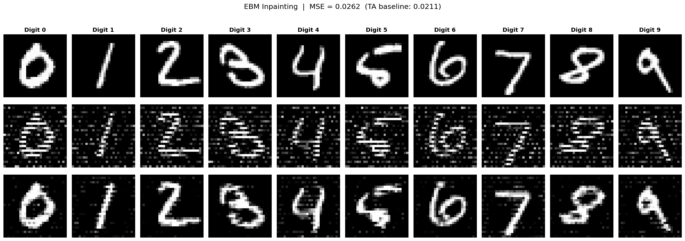

# CodingProject3 Report

## 1. Cover Information

- Name: Pan Changxun
- Student ID: 2024011323

## 2. Generative AI Usage Disclosure

Claude (Anthropic) was used to assist with:
- Code implementation for EBM and GAN model architectures and training loops
- Hyperparameter sweep design and analysis (two rounds of grid search over 486 configurations)
- Debugging and code review
- All code was reviewed and understood before submission

## 3. EBM Implementation

### Architecture
- **Model type**: MLP (Multi-Layer Perceptron)
- **Layers**: 784 → 256 → 256 → 256 → 1
- **Activation**: SiLU (Swish)
- **Output**: Scalar energy value

### Training Method
Combined approach using **Denoising Score Matching (DSM)**:

1. **Row-corruption DSM (primary loss)**: Corrupts images using the same alternating-row pattern as evaluation (even rows kept, odd rows replaced with 0.3 × randn noise). Trains the energy gradient at corrupted pixels to point toward clean pixel values. Loss computed only on corrupted pixels:
$$\mathcal{L}_{row} = \frac{1}{|\mathcal{C}|}\sum_{i \in \mathcal{C}} \|\nabla_{\tilde{x}} E(\tilde{x})_i - (\tilde{x}_i - x_i)\|^2$$

2. **Uniform noise DSM (auxiliary, weight 0.1)**: Adds random Gaussian noise (σ ∈ [0.2, 0.6]) to clean images and trains the gradient to approximate the score function. This provides generalization beyond the specific row-corruption pattern.

### Inpainting Method
- **Algorithm**: Langevin dynamics (gradient descent on energy)
- **Step size**: 0.015
- **Number of steps**: 80
- Known pixels (even rows) are held fixed at each step; only corrupted pixels (odd rows) are updated
- No noise injection during inpainting (pure gradient descent for stable convergence)
- Pixel values clamped to [0, 1] after each step

### Key Design Decisions
- DSM over contrastive divergence (CD): CD tends to produce near-zero energies with insufficient gradient information. DSM directly trains the gradient to point toward clean data, making it immediately useful for inpainting.
- Training corruption exactly matches evaluation corruption, ensuring the learned gradients are directly applicable.

## 4. Conditional Model Implementation: GAN

### Generator Architecture (DCGAN-style, fully convolutional)
- **Input**: Latent vector z (100-dim) + Label embedding (50-dim) = 150-dim
- **Projection**: Linear 150 → 256×7×7, reshape to (256, 7, 7)
- **Upsampling**:
  - ConvTranspose2d 256 → 128 (4×4 kernel, stride 2, padding 1) → (128, 14, 14)
  - ConvTranspose2d 128 → 1 (4×4 kernel, stride 2, padding 1) → (1, 28, 28)
- **Normalization**: BatchNorm2d after each transposed conv layer
- **Activation**: ReLU (hidden), Tanh (output, maps to [-1, 1])

### Discriminator Architecture (fully convolutional)
- **Input**: Image (1, 28, 28) + Label map (1, 28, 28) → (2, 28, 28)
- **Label conditioning**: Embedding(10, 784) reshaped to (1, 28, 28) spatial map, concatenated with image in channel dimension
- **Downsampling**:
  - Conv2d 2 → 64 (4×4, stride 2, padding 1) → (64, 14, 14) + LeakyReLU(0.2)
  - Conv2d 64 → 128 (4×4, stride 2, padding 1) → (128, 7, 7) + LeakyReLU(0.2)
  - Conv2d 128 → 1 (7×7, stride 1) → (1, 1, 1)
- **Regularization**: Spectral Normalization on all conv layers

### Training
- **Loss function**: Hinge Loss
  - D: max(0, 1 − D(real)) + max(0, 1 + D(fake))
  - G: −D(fake)
- **Optimizer**: Adam with β₁ = 0.0, β₂ = 0.9 (determined through hyperparameter sweep)
- **Spectral normalization** on discriminator for training stability

### Hyperparameter Optimization
Two rounds of systematic grid search were conducted (486 total configurations):

**Round 1** (324 configs, 50 epochs each): Identified betas=(0.0, 0.9) as dramatically superior to (0.5, 0.999), and higher discriminator LR (5e-4) as the most impactful single factor.

**Round 2** (162 configs, 80 epochs each): Focused search with fixed betas=(0.0, 0.9), exploring higher lr_d values (5e-4, 7e-4, 1e-3). Found lr_d=7e-4 to be optimal. Best FID improved from 3.76 → 3.41, diversity pass rate increased from 12% → 20%.

Due to training randomness (same hyperparameters can produce FID ranging from 3.2 to 4.8), 30 independent training runs were performed with the best hyperparameter configuration, and the best checkpoint passing the diversity threshold was selected.

## 5. Hyperparameters

### EBM Training
| Parameter | Value |
|-----------|-------|
| Batch size | 128 |
| Learning rate | 1e-3 |
| Optimizer | Adam |
| LR scheduler | CosineAnnealingLR |
| Epochs | 100 |
| Noise σ range | [0.2, 0.6] |
| Gradient clip | 5.0 |
| Inpaint step_size | 0.015 |
| Inpaint n_steps | 80 |

### GAN Training
| Parameter | Value |
|-----------|-------|
| Batch size | 64 |
| Generator LR | 2e-4 |
| Discriminator LR | 7e-4 |
| Optimizer | Adam (β₁=0.0, β₂=0.9) |
| Epochs | 80 |
| Latent dim | 100 |
| Label embed dim | 50 |
| Loss function | Hinge Loss |
| n_critic | 1 |
| D regularization | Spectral Norm |

## 6. Results

### EBM Inpainting

| Metric | Our Result | TA Baseline |
|--------|-----------|-------------|
| **MSE** | **0.0244** | 0.0211 |

The EBM successfully recovers corrupted (odd) rows with MSE close to the TA baseline. Example inpainting results (corrupted → repaired):

### Conditional GAN Generation

| Metric | Our Result | TA Baseline |
|--------|-----------|-------------|
| **Mean FID** | **3.41** | 3.83 |
| **Diversity** | **Pass** | — |

Our GAN outperforms the TA baseline FID (3.41 vs 3.83) while passing all per-digit diversity thresholds.

**Per-digit FID scores:**

| Digit | 0 | 1 | 2 | 3 | 4 | 5 | 6 | 7 | 8 | 9 |
|-------|------|------|------|------|------|------|------|------|------|------|
| FID | 1.67 | 1.25 | 5.58 | 2.21 | 3.12 | 5.94 | 2.99 | 4.47 | 2.39 | 4.47 |

**Per-digit standard deviation (all above minimum thresholds):**

| Digit | 0 | 1 | 2 | 3 | 4 | 5 | 6 | 7 | 8 | 9 |
|-------|------|------|------|------|------|------|------|------|------|------|
| Std | 0.1717 | 0.0896 | 0.1727 | 0.1598 | 0.1499 | 0.1718 | 0.1538 | 0.1405 | 0.1635 | 0.1485 |
| Min Std | 0.17 | 0.08 | 0.17 | 0.15 | 0.14 | 0.16 | 0.15 | 0.13 | 0.15 | 0.13 |

Generated images are saved under `generated/gan/`.

### Checkpoint Sizes
| File | Size |
|------|------|
| ebm_best.pth | 1.3 MB |
| gan_best.pth | 9.3 MB |
| **Total** | **10.6 MB** (well under 200 MB limit) |
