# Diffusion Models & Flow Matching 新手入门教程

> 基于课件 *Diffusion Models & Flow Matching — Pang Tongyao, YMSC*
>
> 本教程面向零基础读者，从直觉出发，结合数学推导与 PyTorch 代码，带你一步步理解当今最强大的生成模型。

---

## 目录

1. [为什么需要生成模型？](#1-为什么需要生成模型)
2. [DDPM：去噪扩散概率模型](#2-ddpm去噪扩散概率模型)
   - 2.1 [核心直觉：加噪与去噪](#21-核心直觉加噪与去噪)
   - 2.2 [前向过程（Forward Process）](#22-前向过程forward-process)
   - 2.3 [反向过程（Reverse Process）](#23-反向过程reverse-process)
   - 2.4 [训练目标（Training Objective）](#24-训练目标training-objective)
   - 2.5 [噪声调度（Noise Schedule）](#25-噪声调度noise-schedule)
   - 2.6 [网络架构：U-Net](#26-网络架构u-net)
   - 2.7 [DDPM vs VAE](#27-ddpm-vs-vae)
   - 2.8 [完整代码实现](#28-完整代码实现)
3. [Score-Based 生成模型与扩散 SDE](#3-score-based-生成模型与扩散-sde)
   - 3.1 [什么是 Score Function？](#31-什么是-score-function)
   - 3.2 [Score Matching 训练方法](#32-score-matching-训练方法)
   - 3.3 [扩散 SDE 框架](#33-扩散-sde-框架)
   - 3.4 [Langevin 动力学采样](#34-langevin-动力学采样)
   - 3.5 [代码：Score-Based 模型](#35-代码score-based-模型)
4. [扩散 ODE 与快速采样](#4-扩散-ode-与快速采样)
   - 4.1 [Probability Flow ODE](#41-probability-flow-ode)
   - 4.2 [DPM-Solver 快速求解器](#42-dpm-solver-快速求解器)
   - 4.3 [DDIM：确定性采样](#43-ddim确定性采样)
5. [Flow Matching：流匹配](#5-flow-matching流匹配)
   - 5.1 [连续正则化流（CNF）回顾](#51-连续正则化流cnf回顾)
   - 5.2 [Flow Matching 的核心思想](#52-flow-matching-的核心思想)
   - 5.3 [条件流匹配（CFM）](#53-条件流匹配cfm)
   - 5.4 [Optimal Transport 路径](#54-optimal-transport-路径)
   - 5.5 [代码：Flow Matching 实现](#55-代码flow-matching-实现)
6. [条件生成：Classifier-Free Guidance](#6-条件生成classifier-free-guidance)
7. [实际应用](#7-实际应用)
   - 7.1 [Latent Diffusion Models (Stable Diffusion)](#71-latent-diffusion-models-stable-diffusion)
   - 7.2 [DALL-E 2 & 3：文生图](#72-dall-e-2--3文生图)
   - 7.3 [SDEdit：图像编辑](#73-sdedit图像编辑)
   - 7.4 [ControlNet：可控生成](#74-controlnet可控生成)
   - 7.5 [SORA & Diffusion Transformer：视频生成](#75-sora--diffusion-transformer视频生成)
   - 7.6 [AlphaFold 3：蛋白质结构预测](#76-alphafold-3蛋白质结构预测)
8. [总结与学习路线图](#8-总结与学习路线图)

---

## 1. 为什么需要生成模型？

**生成模型的目标**：学习数据的分布 $p_{\text{data}}(x)$，从而能够生成新的、逼真的样本。

想象你有一堆猫的照片，生成模型就是要"学会"猫长什么样，然后自己"画"出新的猫。

| 模型 | 核心思想 | 优点 | 缺点 |
|------|---------|------|------|
| **GAN** | 生成器 vs 判别器博弈 | 生成质量高、速度快 | 训练不稳定、模式坍塌 |
| **VAE** | 编码-解码 + 变分推断 | 训练稳定、有潜空间 | 生成模糊 |
| **Diffusion** | 逐步加噪 → 逐步去噪 | 生成质量最高、训练稳定 | 采样速度慢 |
| **Flow Matching** | 学习从噪声到数据的向量场 | 训练简单、采样快 | 较新，生态不完善 |

---

## 2. DDPM：去噪扩散概率模型

> 参考论文：Ho et al., *Denoising Diffusion Probabilistic Models*, NeurIPS 2020

### 2.1 核心直觉：加噪与去噪

DDPM 的核心思想非常简单，可以用一句话概括：

> **把一张图片逐步加噪变成纯噪声（前向过程），然后训练一个神经网络学会从噪声逐步还原出图片（反向过程）。**

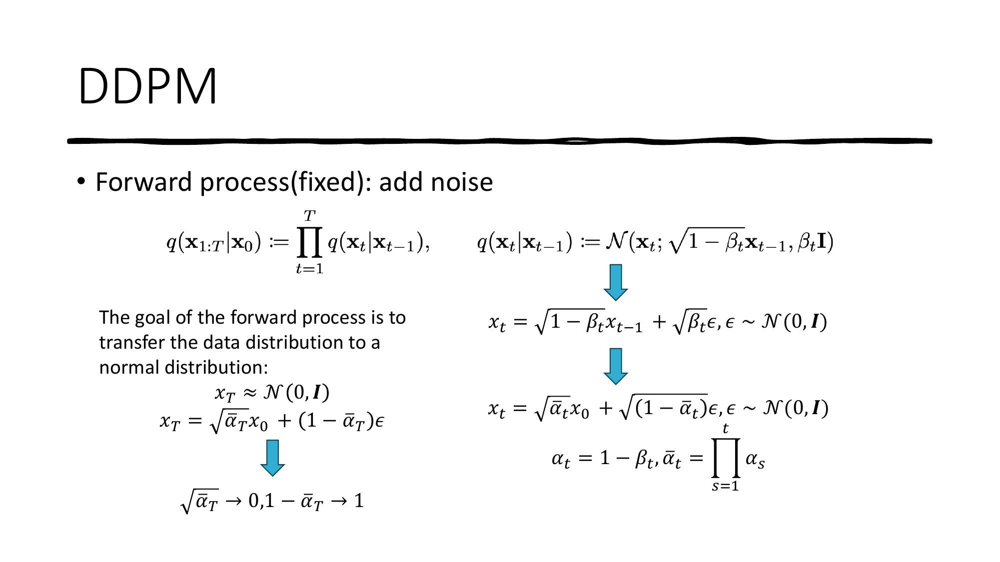

想象你在沙滩上画了一幅画：
- **前向过程**（加噪）= 风逐渐把沙子吹乱，画越来越模糊，最后完全变成平坦的沙地（纯噪声）
- **反向过程**（去噪）= 你学会了风吹乱沙子的规律，可以"倒放"这个过程，从平坦沙地重新画出画

### 2.2 前向过程（Forward Process）

前向过程是**固定的**（不需要学习），就是逐步往数据上加高斯噪声：

**单步加噪**：

$$x_t = \sqrt{1-\beta_t} \cdot x_{t-1} + \sqrt{\beta_t} \cdot \epsilon, \quad \epsilon \sim \mathcal{N}(0, \mathbf{I})$$

其中 $\beta_t$ 是第 $t$ 步的噪声强度（一个很小的数，比如 0.0001 到 0.02）。

**直接跳到第 $t$ 步**（重参数化技巧，非常重要！）：

$$x_t = \sqrt{\bar{\alpha}_t} \cdot x_0 + \sqrt{1-\bar{\alpha}_t} \cdot \epsilon, \quad \epsilon \sim \mathcal{N}(0, \mathbf{I})$$

其中：
- $\alpha_t = 1 - \beta_t$（每步保留的信号比例）
- $\bar{\alpha}_t = \prod_{s=1}^{t} \alpha_s$（累积信号保留比例）

**直觉理解**：
- 当 $t=0$ 时，$\bar{\alpha}_0 \approx 1$，所以 $x_0 \approx x_0$（几乎没加噪）
- 当 $t=T$ 时，$\bar{\alpha}_T \approx 0$，所以 $x_T \approx \epsilon$（几乎纯噪声）

```python
import torch
import torch.nn as nn

def forward_diffusion(x_0, t, sqrt_alphas_cumprod, sqrt_one_minus_alphas_cumprod):
    """
    前向过程：给干净图片 x_0 加噪到第 t 步

    参数:
        x_0: 干净图片 [B, C, H, W]
        t:   时间步   [B]
        sqrt_alphas_cumprod:           √ᾱ_t 的查找表
        sqrt_one_minus_alphas_cumprod: √(1-ᾱ_t) 的查找表

    返回:
        x_t:     加噪后的图片
        epsilon: 加的噪声（用作训练标签）
    """
    # 采样随机噪声
    epsilon = torch.randn_like(x_0)

    # 取出对应时间步的系数，reshape 以便广播
    sqrt_alpha = sqrt_alphas_cumprod[t].view(-1, 1, 1, 1)
    sqrt_one_minus_alpha = sqrt_one_minus_alphas_cumprod[t].view(-1, 1, 1, 1)

    # 一步到位：x_t = √ᾱ_t · x_0 + √(1-ᾱ_t) · ε
    x_t = sqrt_alpha * x_0 + sqrt_one_minus_alpha * epsilon

    return x_t, epsilon
```

### 2.3 反向过程（Reverse Process）

反向过程是我们要**学习**的部分。我们训练一个神经网络 $\epsilon_\theta(x_t, t)$ 来**预测加在图片上的噪声**。

知道了噪声，就能从 $x_t$ 恢复 $x_{t-1}$：

$$x_{t-1} = \frac{1}{\sqrt{\alpha_t}} \left( x_t - \frac{\beta_t}{\sqrt{1-\bar{\alpha}_t}} \epsilon_\theta(x_t, t) \right) + \sigma_t z$$

其中 $z \sim \mathcal{N}(0, \mathbf{I})$，$\sigma_t$ 是噪声系数。

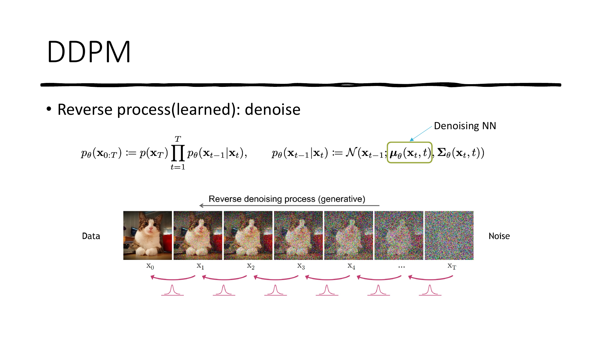

```python
@torch.no_grad()
def reverse_diffusion_step(model, x_t, t, betas, alphas, alphas_cumprod):
    """
    反向过程的单步：从 x_t 预测 x_{t-1}
    """
    beta_t = betas[t]
    alpha_t = alphas[t]
    alpha_bar_t = alphas_cumprod[t]

    # 神经网络预测噪声
    predicted_noise = model(x_t, t)

    # 计算均值
    mean = (1 / torch.sqrt(alpha_t)) * (
        x_t - (beta_t / torch.sqrt(1 - alpha_bar_t)) * predicted_noise
    )

    if t > 0:
        noise = torch.randn_like(x_t)
        sigma = torch.sqrt(beta_t)
        x_t_minus_1 = mean + sigma * noise
    else:
        x_t_minus_1 = mean  # 最后一步不加噪

    return x_t_minus_1


@torch.no_grad()
def sample(model, image_shape, T, betas, alphas, alphas_cumprod, device):
    """
    完整的采样过程：从纯噪声生成图片
    """
    # 从标准正态分布采样开始
    x = torch.randn(image_shape).to(device)

    # 逐步去噪：T → T-1 → ... → 1 → 0
    for t in reversed(range(T)):
        t_batch = torch.full((image_shape[0],), t, device=device, dtype=torch.long)
        x = reverse_diffusion_step(model, x, t_batch, betas, alphas, alphas_cumprod)

    return x
```

### 2.4 训练目标（Training Objective）

DDPM 的训练目标源自变分推断（ELBO），但最终简化为一个极其简单的形式：

$$\mathcal{L}_{\text{simple}} = \mathbb{E}_{x_0, \epsilon, t} \left[ \| \epsilon - \epsilon_\theta(x_t, t) \|^2 \right]$$

**翻译成人话**：
1. 随机取一张真实图片 $x_0$
2. 随机选一个时间步 $t$
3. 随机生成噪声 $\epsilon$，加到图片上得到 $x_t$
4. 用神经网络预测噪声 $\hat{\epsilon} = \epsilon_\theta(x_t, t)$
5. 计算预测噪声与真实噪声的 MSE 损失

```python
def train_step(model, optimizer, x_0, T, sqrt_alphas_cumprod, sqrt_one_minus_alphas_cumprod):
    """
    DDPM 的一步训练
    """
    batch_size = x_0.shape[0]
    device = x_0.device

    # 1. 随机选择时间步 t ∈ {0, 1, ..., T-1}
    t = torch.randint(0, T, (batch_size,), device=device)

    # 2. 前向加噪
    x_t, epsilon = forward_diffusion(x_0, t, sqrt_alphas_cumprod, sqrt_one_minus_alphas_cumprod)

    # 3. 神经网络预测噪声
    predicted_noise = model(x_t, t)

    # 4. 计算 MSE 损失
    loss = nn.functional.mse_loss(predicted_noise, epsilon)

    # 5. 反向传播
    optimizer.zero_grad()
    loss.backward()
    optimizer.step()

    return loss.item()
```

> **重要洞察**：不同时间步的训练是可以**并行**的！因为我们可以直接从 $x_0$ 跳到任意 $x_t$，不需要逐步加噪。这使得训练非常高效。

### 2.5 噪声调度（Noise Schedule）

$\beta_t$ 的选择（噪声调度）对生成质量影响很大。常见的调度方式：

| 调度方式 | 公式 | 特点 |
|---------|------|------|
| **线性** (Linear) | $\beta_t$ 从 $10^{-4}$ 线性增加到 $0.02$ | 简单，原始 DDPM 使用 |
| **余弦** (Cosine) | $\bar{\alpha}_t = \cos^2\left(\frac{t/T + s}{1+s} \cdot \frac{\pi}{2}\right)$ | 更平滑，Improved DDPM 使用 |

```python
def linear_beta_schedule(T, beta_start=1e-4, beta_end=0.02):
    """线性噪声调度"""
    return torch.linspace(beta_start, beta_end, T)


def cosine_beta_schedule(T, s=0.008):
    """余弦噪声调度（Improved DDPM）"""
    steps = torch.arange(T + 1, dtype=torch.float64) / T
    alphas_cumprod = torch.cos((steps + s) / (1 + s) * torch.pi * 0.5) ** 2
    alphas_cumprod = alphas_cumprod / alphas_cumprod[0]
    betas = 1 - (alphas_cumprod[1:] / alphas_cumprod[:-1])
    return torch.clip(betas, 0.0001, 0.9999).float()
```

### 2.6 网络架构：U-Net

DDPM 使用 **U-Net** 作为去噪网络 $\epsilon_\theta(x_t, t)$。

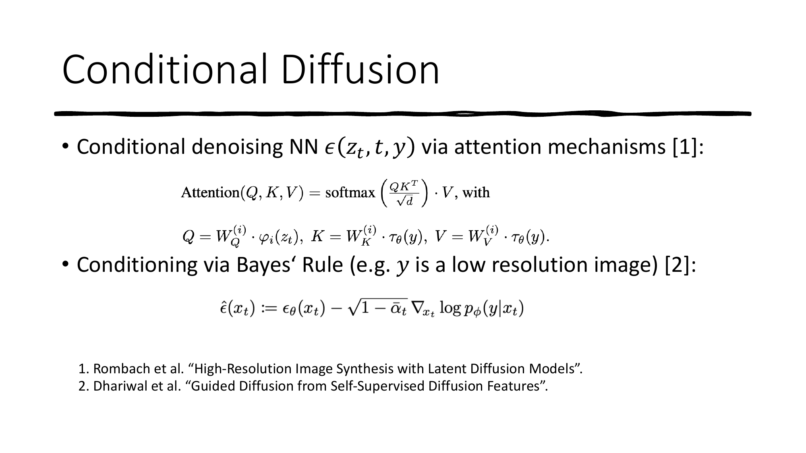

**关键设计**：
- **编码器-解码器结构**：先下采样提取特征，再上采样恢复分辨率
- **跳跃连接（Skip Connections）**：保留细节信息
- **时间步嵌入**：通过正弦位置编码将 $t$ 注入网络的每一层
- **自注意力层**：在低分辨率特征图上使用，捕获全局依赖

```python
import math

class SinusoidalPositionEmbedding(nn.Module):
    """时间步的正弦位置编码（类似 Transformer 的位置编码）"""
    def __init__(self, dim):
        super().__init__()
        self.dim = dim

    def forward(self, t):
        device = t.device
        half_dim = self.dim // 2
        embeddings = math.log(10000) / (half_dim - 1)
        embeddings = torch.exp(torch.arange(half_dim, device=device) * -embeddings)
        embeddings = t[:, None] * embeddings[None, :]
        embeddings = torch.cat([embeddings.sin(), embeddings.cos()], dim=-1)
        return embeddings


class ResBlock(nn.Module):
    """带时间步条件的残差块"""
    def __init__(self, in_ch, out_ch, time_emb_dim):
        super().__init__()
        self.conv1 = nn.Conv2d(in_ch, out_ch, 3, padding=1)
        self.conv2 = nn.Conv2d(out_ch, out_ch, 3, padding=1)
        self.time_mlp = nn.Linear(time_emb_dim, out_ch)
        self.norm1 = nn.GroupNorm(8, out_ch)
        self.norm2 = nn.GroupNorm(8, out_ch)
        self.act = nn.SiLU()

        # 如果通道数不同，需要投影
        self.shortcut = nn.Conv2d(in_ch, out_ch, 1) if in_ch != out_ch else nn.Identity()

    def forward(self, x, t_emb):
        h = self.act(self.norm1(self.conv1(x)))
        # 将时间步信息加入特征图
        h = h + self.time_mlp(self.act(t_emb))[:, :, None, None]
        h = self.act(self.norm2(self.conv2(h)))
        return h + self.shortcut(x)


class SimpleUNet(nn.Module):
    """简化版 U-Net（用于理解原理）"""
    def __init__(self, in_channels=1, base_channels=64, time_emb_dim=256):
        super().__init__()

        # 时间步编码
        self.time_embed = nn.Sequential(
            SinusoidalPositionEmbedding(time_emb_dim),
            nn.Linear(time_emb_dim, time_emb_dim),
            nn.SiLU(),
        )

        # 编码器（下采样）
        self.down1 = ResBlock(in_channels, base_channels, time_emb_dim)
        self.down2 = ResBlock(base_channels, base_channels * 2, time_emb_dim)
        self.pool = nn.MaxPool2d(2)

        # 瓶颈层
        self.bottleneck = ResBlock(base_channels * 2, base_channels * 2, time_emb_dim)

        # 解码器（上采样）
        self.up2 = ResBlock(base_channels * 4, base_channels, time_emb_dim)  # 拼接跳跃连接
        self.up1 = ResBlock(base_channels * 2, base_channels, time_emb_dim)
        self.upconv2 = nn.ConvTranspose2d(base_channels * 2, base_channels * 2, 2, stride=2)
        self.upconv1 = nn.ConvTranspose2d(base_channels, base_channels, 2, stride=2)

        # 输出层
        self.out = nn.Conv2d(base_channels, in_channels, 1)

    def forward(self, x, t):
        t_emb = self.time_embed(t)

        # 编码
        d1 = self.down1(x, t_emb)          # [B, 64, H, W]
        d2 = self.down2(self.pool(d1), t_emb)  # [B, 128, H/2, W/2]

        # 瓶颈
        b = self.bottleneck(self.pool(d2), t_emb)  # [B, 128, H/4, W/4]

        # 解码 + 跳跃连接
        u2 = self.upconv2(b)                         # [B, 128, H/2, W/2]
        u2 = self.up2(torch.cat([u2, d2], dim=1), t_emb)  # 拼接跳跃连接
        u1 = self.upconv1(u2)                         # [B, 64, H, W]
        u1 = self.up1(torch.cat([u1, d1], dim=1), t_emb)

        return self.out(u1)
```

### 2.7 DDPM vs VAE

| 对比维度 | DDPM | VAE |
|---------|------|-----|
| 编码器 | **固定**（加噪过程） | 可学习 |
| 潜变量维度 | 与数据**同维** | 通常**压缩** |
| 去噪/解码网络 | 所有时间步**共享** | 单个解码器 |
| 训练 | 时间步可**并行** | 端到端 |
| 采样 | **慢**（需 1000+ 步） | **快**（单步） |
| 训练稳定性 | 很稳定（无后验坍塌） | 可能后验坍塌 |

### 2.8 完整代码实现

以下是一个完整的 DDPM 训练示例（在 MNIST 数据集上）：

```python
import torch
import torch.nn as nn
from torch.utils.data import DataLoader
from torchvision import datasets, transforms
import matplotlib.pyplot as plt

# ==================== 超参数 ====================
T = 1000              # 总扩散步数
beta_start = 1e-4
beta_end = 0.02
img_size = 28
channels = 1
batch_size = 128
lr = 2e-4
epochs = 20
device = torch.device('cuda' if torch.cuda.is_available() else 'cpu')

# ==================== 噪声调度 ====================
betas = torch.linspace(beta_start, beta_end, T).to(device)
alphas = 1. - betas
alphas_cumprod = torch.cumprod(alphas, dim=0)
sqrt_alphas_cumprod = torch.sqrt(alphas_cumprod)
sqrt_one_minus_alphas_cumprod = torch.sqrt(1. - alphas_cumprod)

# ==================== 数据集 ====================
transform = transforms.Compose([
    transforms.ToTensor(),
    transforms.Normalize((0.5,), (0.5,)),  # 归一化到 [-1, 1]
])
dataset = datasets.MNIST(root='./data', train=True, download=True, transform=transform)
dataloader = DataLoader(dataset, batch_size=batch_size, shuffle=True)

# ==================== 模型 ====================
model = SimpleUNet(in_channels=channels).to(device)
optimizer = torch.optim.Adam(model.parameters(), lr=lr)

# ==================== 训练循环 ====================
for epoch in range(epochs):
    total_loss = 0
    for batch_idx, (x_0, _) in enumerate(dataloader):
        x_0 = x_0.to(device)
        loss = train_step(model, optimizer, x_0, T,
                         sqrt_alphas_cumprod, sqrt_one_minus_alphas_cumprod)
        total_loss += loss

    avg_loss = total_loss / len(dataloader)
    print(f"Epoch {epoch+1}/{epochs}, Loss: {avg_loss:.4f}")

# ==================== 生成样本 ====================
samples = sample(model, (16, channels, img_size, img_size),
                T, betas, alphas, alphas_cumprod, device)
# 可视化
fig, axes = plt.subplots(4, 4, figsize=(8, 8))
for i, ax in enumerate(axes.flat):
    ax.imshow(samples[i, 0].cpu().numpy(), cmap='gray')
    ax.axis('off')
plt.savefig('ddpm_samples.png')
plt.show()
```

---

## 3. Score-Based 生成模型与扩散 SDE

> 参考论文：Song et al., *Score-Based Generative Modeling through Stochastic Differential Equations*, ICLR 2021

### 3.1 什么是 Score Function？

**Score Function（得分函数）** 是概率密度函数的对数梯度：

$$s(x) = \nabla_x \log p(x)$$

**直觉理解**：Score Function 指向数据密度增大的方向。想象一座山（概率密度是山的高度），Score Function 就是在每个点的"上山方向"。

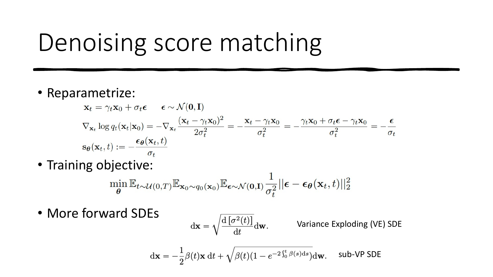

**为什么用 Score 而不是直接学 $p(x)$？**

因为 $p(x) = \frac{e^{-E(x)}}{Z}$ 中的归一化常数 $Z = \int e^{-E(x)} dx$ 通常**无法计算**。但 Score Function 巧妙地避开了这个问题：

$$\nabla_x \log p(x) = \nabla_x \log \frac{e^{-E(x)}}{Z} = -\nabla_x E(x)$$

$Z$ 是常数，求梯度后消失了！

### 3.2 Score Matching 训练方法

我们要训练 $s_\theta(x) \approx \nabla_x \log p(x)$，但问题是真实的 $\nabla_x \log p(x)$ 未知。

Score Matching 提供了几种解决方案：

#### 3.2.1 Denoising Score Matching（去噪得分匹配）

**这是扩散模型中实际使用的方法**：

$$\mathcal{L} = \mathbb{E}_{x_0, x_t} \| s_\theta(x_t, t) - \nabla_{x_t} \log q(x_t | x_0) \|^2$$

由于 $q(x_t | x_0) = \mathcal{N}(x_t; \sqrt{\bar{\alpha}_t} x_0, (1-\bar{\alpha}_t)\mathbf{I})$，其 Score 有解析解：

$$\nabla_{x_t} \log q(x_t | x_0) = -\frac{x_t - \sqrt{\bar{\alpha}_t} x_0}{1 - \bar{\alpha}_t} = -\frac{\epsilon}{\sqrt{1-\bar{\alpha}_t}}$$

所以**预测 Score 和预测噪声本质上是同一件事**！

$$s_\theta(x_t, t) = -\frac{\epsilon_\theta(x_t, t)}{\sqrt{1-\bar{\alpha}_t}}$$

#### 3.2.2 噪声扰动的必要性

为什么不能直接在原始数据上做 Score Matching？

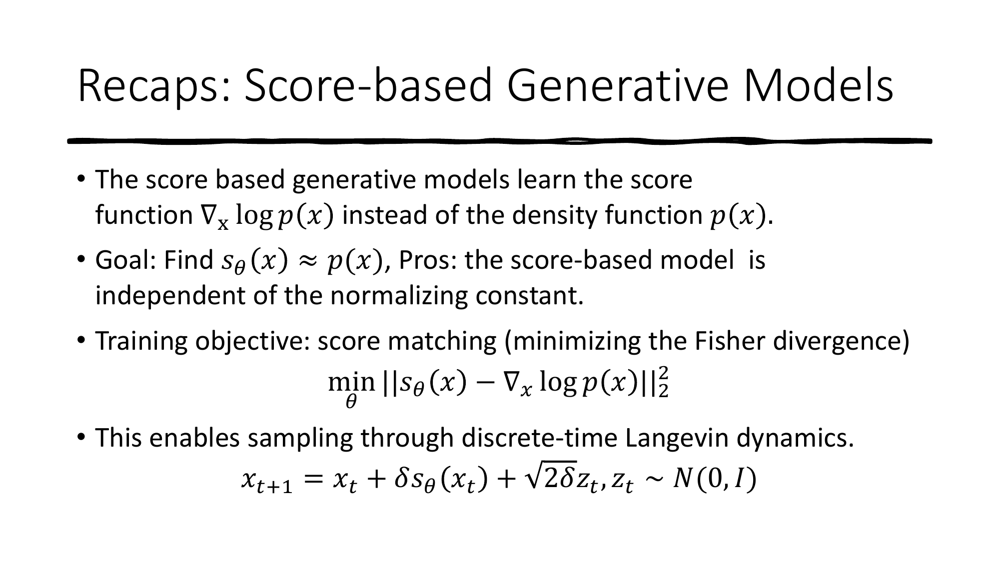

因为在**低密度区域**，数据点稀少，Score 的估计不准确。加噪声可以"填充"这些区域。

**解决方案**：使用多个尺度的噪声扰动数据，从大噪声开始（覆盖全局），逐渐减小到小噪声（保留细节）—— 这正是扩散模型所做的！

### 3.3 扩散 SDE 框架

当时间步无限小时，DDPM 的前向过程变为**随机微分方程（SDE）**：

$$dx = f(x, t)dt + g(t)dw$$

其中 $w$ 是标准 Wiener 过程（布朗运动）。

**反向 SDE**：

$$dx = [f(x,t) - g(t)^2 \nabla_x \log p_t(x)]dt + g(t)d\bar{w}$$

常见的 SDE 类型：

| SDE 类型 | 特点 |
|---------|------|
| VP-SDE（DDPM） | 方差保持不变 |
| VE-SDE（SMLD） | 方差逐渐增大 |
| sub-VP SDE | VP 的变体 |

### 3.4 Langevin 动力学采样

**Langevin 动力学**是使用 Score Function 从分布中采样的方法：

$$x_{t+1} = x_t + \delta \cdot s_\theta(x_t) + \sqrt{2\delta} \cdot z_t, \quad z_t \sim \mathcal{N}(0, \mathbf{I})$$

**直觉**：沿着"上山方向"（Score）走，加上随机扰动（噪声），最终会停在概率密度高的地方。

**退火 Langevin 动力学**（Annealed Langevin Dynamics）：先用大噪声获得全局覆盖，再逐步减小噪声精细化。

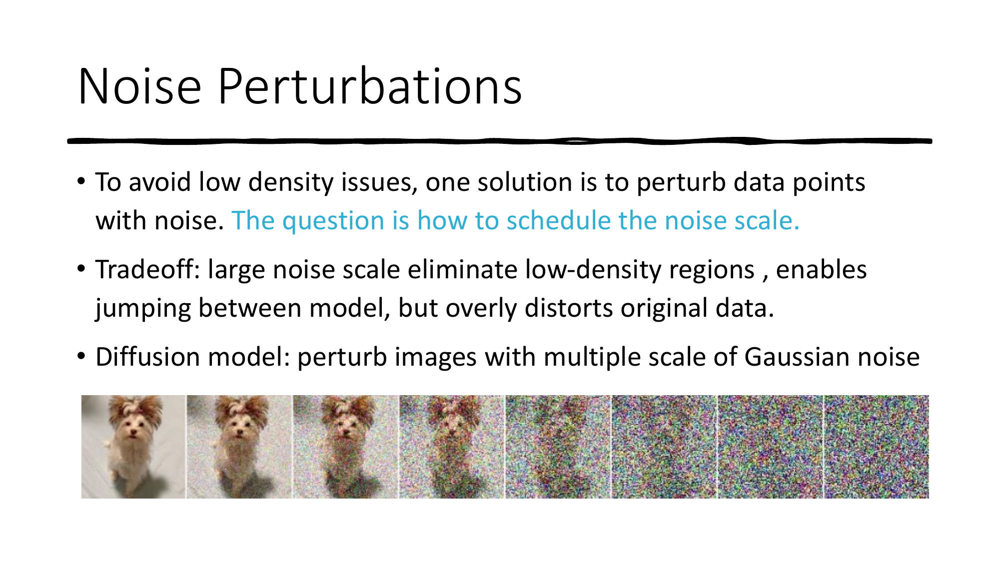

### 3.5 代码：Score-Based 模型

```python
class ScoreNetwork(nn.Module):
    """Score 网络：预测 ∇_x log p_t(x)"""
    def __init__(self, input_dim=2, hidden_dim=128, time_emb_dim=64):
        super().__init__()
        self.time_embed = nn.Sequential(
            SinusoidalPositionEmbedding(time_emb_dim),
            nn.Linear(time_emb_dim, time_emb_dim),
            nn.SiLU(),
        )
        self.net = nn.Sequential(
            nn.Linear(input_dim + time_emb_dim, hidden_dim),
            nn.SiLU(),
            nn.Linear(hidden_dim, hidden_dim),
            nn.SiLU(),
            nn.Linear(hidden_dim, hidden_dim),
            nn.SiLU(),
            nn.Linear(hidden_dim, input_dim),
        )

    def forward(self, x, t):
        t_emb = self.time_embed(t)
        return self.net(torch.cat([x, t_emb], dim=-1))


def denoising_score_matching_loss(score_net, x_0, t, alphas_cumprod):
    """
    去噪得分匹配损失

    目标：让 score_net(x_t, t) ≈ ∇_{x_t} log q(x_t | x_0)
    """
    alpha_bar = alphas_cumprod[t].view(-1, 1)

    # 加噪
    epsilon = torch.randn_like(x_0)
    x_t = torch.sqrt(alpha_bar) * x_0 + torch.sqrt(1 - alpha_bar) * epsilon

    # 真实 Score = -ε / √(1 - ᾱ_t)
    target_score = -epsilon / torch.sqrt(1 - alpha_bar)

    # 预测 Score
    predicted_score = score_net(x_t, t.float())

    loss = torch.mean(torch.sum((predicted_score - target_score) ** 2, dim=-1))
    return loss


def langevin_dynamics(score_net, shape, n_steps=1000, step_size=0.01, device='cpu'):
    """
    Langevin 动力学采样
    """
    x = torch.randn(shape).to(device)

    for i in range(n_steps):
        t = torch.ones(shape[0], device=device) * (n_steps - i) / n_steps
        score = score_net(x, t)
        noise = torch.randn_like(x)
        x = x + step_size * score + (2 * step_size) ** 0.5 * noise

    return x
```

---

## 4. 扩散 ODE 与快速采样

### 4.1 Probability Flow ODE

一个关键发现：**存在一个确定性的 ODE，与扩散 SDE 具有完全相同的边际分布**：

$$\frac{dx}{dt} = f(x,t) - \frac{1}{2}g(t)^2 \nabla_x \log p_t(x)$$

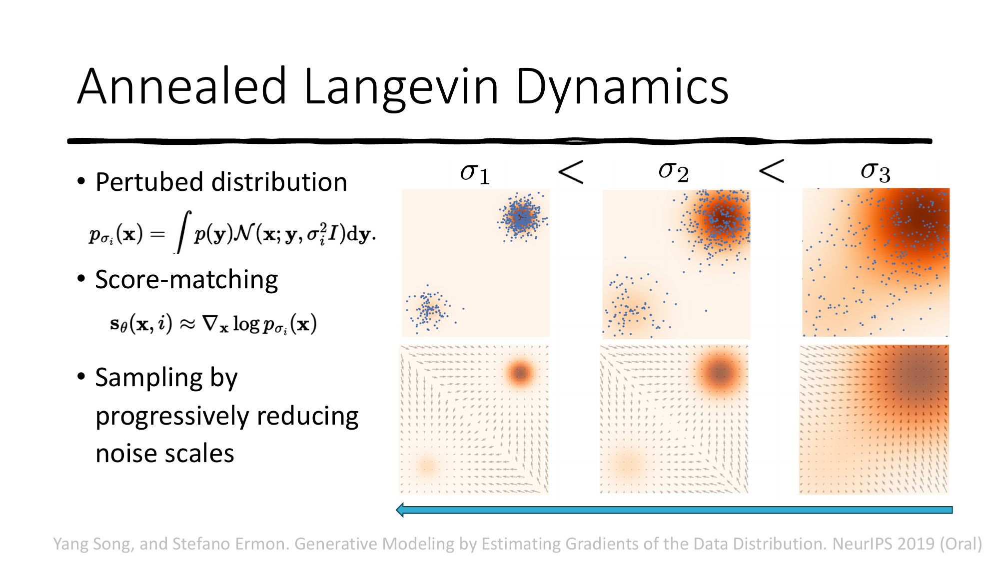

这意味着：
1. **确定性采样**：不需要随机噪声，相同的起点总是生成相同的结果
2. **精确似然计算**：通过连续变量替换公式计算 $\log p(x)$
3. **语义插值**：在潜空间中插值会产生语义上有意义的过渡

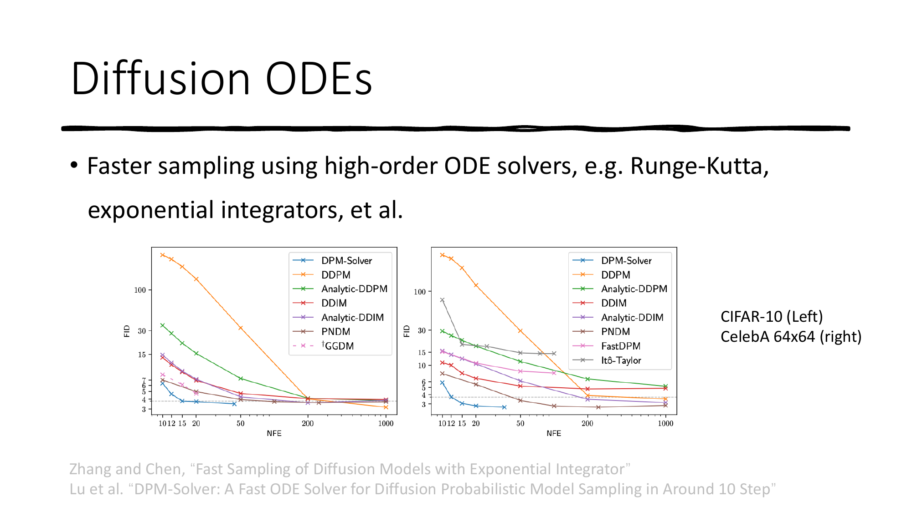

### 4.2 DPM-Solver 快速求解器

标准 DDPM 需要 1000 步采样，太慢了！DPM-Solver 通过高阶 ODE 求解器加速：

| 方法 | 采样步数 | 质量 |
|------|---------|------|
| DDPM | ~1000 步 | 基准 |
| DDIM (1阶) | ~50-100 步 | 略有下降 |
| DPM-Solver-2 (2阶) | ~20-50 步 | 接近基准 |
| DPM-Solver-3 (3阶) | ~10-20 步 | 接近基准 |

核心思想：将 ODE 改写为半线性形式，找到积分因子，然后用高阶数值方法近似积分。

```python
class DPMSolver:
    """DPM-Solver: 快速扩散模型采样器（简化版）"""

    def __init__(self, model, alphas_cumprod, device):
        self.model = model
        self.alphas_cumprod = alphas_cumprod
        self.device = device

    def _log_snr(self, t):
        """计算 Log-SNR: λ(t) = log(ᾱ_t / (1 - ᾱ_t))"""
        alpha_bar = self.alphas_cumprod[t]
        return torch.log(alpha_bar / (1 - alpha_bar))

    @torch.no_grad()
    def sample_first_order(self, x_T, timesteps):
        """
        DPM-Solver-1 (等价于 DDIM)
        """
        x = x_T
        for i in range(len(timesteps) - 1):
            t = timesteps[i]
            t_prev = timesteps[i + 1]

            # 预测噪声
            eps = self.model(x, torch.full((x.shape[0],), t, device=self.device))

            alpha_t = self.alphas_cumprod[t]
            alpha_prev = self.alphas_cumprod[t_prev]

            # DDIM 更新公式
            x0_pred = (x - torch.sqrt(1 - alpha_t) * eps) / torch.sqrt(alpha_t)
            x = torch.sqrt(alpha_prev) * x0_pred + torch.sqrt(1 - alpha_prev) * eps

        return x
```

### 4.3 DDIM：确定性采样

DDIM（Denoising Diffusion Implicit Models）是 DPM-Solver-1 的特例，实现确定性采样：

$$x_{t-1} = \sqrt{\bar{\alpha}_{t-1}} \underbrace{\left(\frac{x_t - \sqrt{1-\bar{\alpha}_t} \epsilon_\theta(x_t)}{\sqrt{\bar{\alpha}_t}}\right)}_{\text{预测的 } x_0} + \sqrt{1-\bar{\alpha}_{t-1}} \cdot \epsilon_\theta(x_t)$$

```python
@torch.no_grad()
def ddim_sample(model, shape, T, alphas_cumprod, num_steps=50, device='cpu'):
    """
    DDIM 采样：用更少的步数生成图像

    num_steps: 实际采样步数（比如 50 步代替 1000 步）
    """
    # 均匀选取 num_steps 个时间步
    step_size = T // num_steps
    timesteps = list(range(0, T, step_size))[::-1]

    x = torch.randn(shape).to(device)

    for i in range(len(timesteps) - 1):
        t = timesteps[i]
        t_prev = timesteps[i + 1]

        t_batch = torch.full((shape[0],), t, device=device, dtype=torch.long)

        # 预测噪声
        eps = model(x, t_batch)

        alpha_t = alphas_cumprod[t]
        alpha_prev = alphas_cumprod[t_prev]

        # 预测 x_0
        x0_pred = (x - torch.sqrt(1 - alpha_t) * eps) / torch.sqrt(alpha_t)
        x0_pred = torch.clamp(x0_pred, -1, 1)  # 裁剪到合理范围

        # DDIM 更新（确定性，无噪声）
        x = torch.sqrt(alpha_prev) * x0_pred + torch.sqrt(1 - alpha_prev) * eps

    return x
```

---

## 5. Flow Matching：流匹配

> 参考：Lipman et al., *Flow Matching for Generative Modeling*, 2022
>
> Cambridge MLG Blog: *An Introduction to Flow Matching*

### 5.1 连续正则化流（CNF）回顾

**连续正则化流** 通过一个 ODE 将简单分布（如高斯）变换到数据分布：

$$\frac{dx_t}{dt} = u_\theta(t, x_t), \quad t \in [0, 1]$$

- $t=0$：噪声分布 $p_0 = \mathcal{N}(0, \mathbf{I})$
- $t=1$：数据分布 $p_1 \approx p_{\text{data}}$

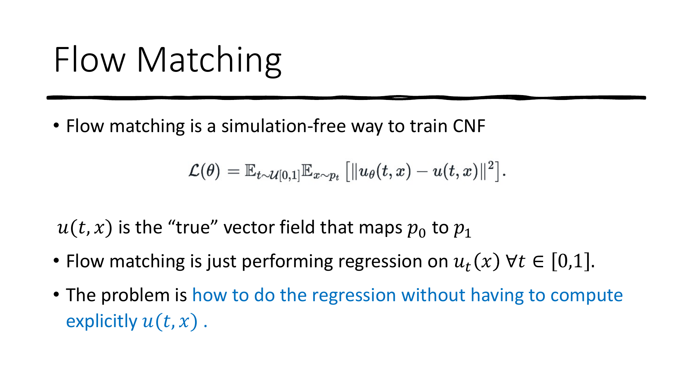

**传统 CNF 的问题**：训练时需要昂贵的 ODE 模拟和散度计算，难以扩展。

### 5.2 Flow Matching 的核心思想

Flow Matching 提供了一种**无需模拟（simulation-free）**的 CNF 训练方法：

$$\mathcal{L}_{FM}(\theta) = \mathbb{E}_{t, x_t} \| u_\theta(t, x_t) - u_t(x_t) \|^2$$

**目标**：让神经网络 $u_\theta$ 学习一个向量场，这个向量场能把噪声"推"向数据。

**问题**：真实的向量场 $u_t(x)$ 无法直接计算（因为不知道数据分布的精确形式）。

**解决方案**：条件流匹配（Conditional Flow Matching）

### 5.3 条件流匹配（CFM）

核心洞察：虽然无法计算边际向量场 $u_t(x)$，但**条件向量场** $u_t(x|x_1)$ 是可以解析计算的！

**最简单的条件路径**（Optimal Transport 路径）：

$$x_t = (1-t) \cdot x_0 + t \cdot x_1$$

其中 $x_0 \sim \mathcal{N}(0, \mathbf{I})$（噪声），$x_1 \sim p_{\text{data}}$（数据）。

**条件向量场**：

$$u_t(x_t | x_1) = \frac{dx_t}{dt} = x_1 - x_0$$

这就是一条从噪声指向数据的**直线**！

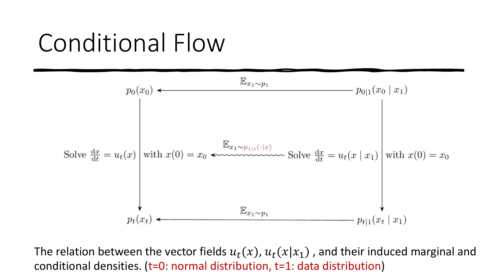

**CFM 损失**（等价于 FM 损失 + 常数）：

$$\mathcal{L}_{CFM}(\theta) = \mathbb{E}_{t, x_0, x_1} \| u_\theta(t, x_t) - (x_1 - x_0) \|^2$$

**训练流程**：
1. 采样 $x_0 \sim \mathcal{N}(0, \mathbf{I})$，$x_1 \sim p_{\text{data}}$，$t \sim \text{Uniform}(0, 1)$
2. 计算 $x_t = (1-t)x_0 + t \cdot x_1$
3. 目标向量场 = $x_1 - x_0$
4. 最小化 $\| u_\theta(t, x_t) - (x_1 - x_0) \|^2$

### 5.4 Optimal Transport 路径

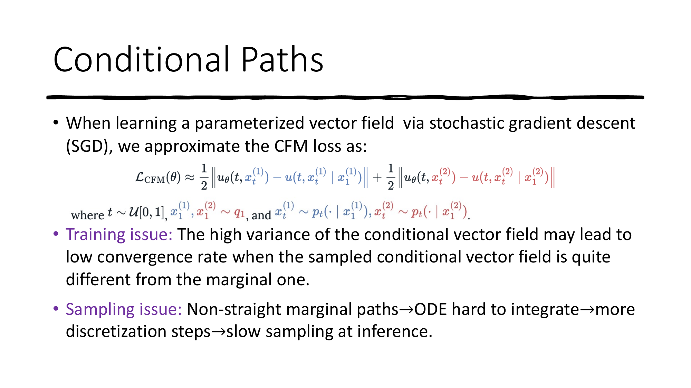

**为什么 OT 路径更好？**

- **Diffusion 路径**：$x_0$ 和 $x_1$ 的配对是随机的，路径弯曲，方差大
- **OT 路径**：直线连接，路径最短，方差小，采样更快

路径的"直"意味着用少量步数就能准确积分 ODE，大幅加速推理。

### 5.5 代码：Flow Matching 实现

```python
class FlowMatchingModel(nn.Module):
    """Flow Matching 向量场网络"""
    def __init__(self, data_dim=2, hidden_dim=256, time_emb_dim=64):
        super().__init__()
        self.time_embed = nn.Sequential(
            SinusoidalPositionEmbedding(time_emb_dim),
            nn.Linear(time_emb_dim, time_emb_dim),
            nn.SiLU(),
        )
        self.net = nn.Sequential(
            nn.Linear(data_dim + time_emb_dim, hidden_dim),
            nn.SiLU(),
            nn.Linear(hidden_dim, hidden_dim),
            nn.SiLU(),
            nn.Linear(hidden_dim, hidden_dim),
            nn.SiLU(),
            nn.Linear(hidden_dim, data_dim),
        )

    def forward(self, x, t):
        """预测向量场 u_θ(t, x_t)"""
        t_emb = self.time_embed(t)
        return self.net(torch.cat([x, t_emb], dim=-1))


def flow_matching_loss(model, x_1, device):
    """
    条件流匹配损失（OT 路径）

    x_1: 真实数据样本 [B, D]
    """
    batch_size = x_1.shape[0]

    # 1. 采样噪声 x_0 ~ N(0, I)
    x_0 = torch.randn_like(x_1)

    # 2. 采样时间 t ~ Uniform(0, 1)
    t = torch.rand(batch_size, device=device)

    # 3. 插值得到 x_t = (1-t) * x_0 + t * x_1
    t_expand = t.view(-1, 1)  # [B, 1] 用于广播
    x_t = (1 - t_expand) * x_0 + t_expand * x_1

    # 4. 目标向量场 = x_1 - x_0（从噪声指向数据的方向）
    target = x_1 - x_0

    # 5. 网络预测向量场
    predicted = model(x_t, t)

    # 6. MSE 损失
    loss = torch.mean((predicted - target) ** 2)
    return loss


@torch.no_grad()
def flow_matching_sample(model, shape, num_steps=100, device='cpu'):
    """
    ODE 采样：从噪声出发，沿向量场积分到数据分布

    使用欧拉法（最简单的 ODE 求解器）
    """
    # 从标准正态分布开始
    x = torch.randn(shape).to(device)

    dt = 1.0 / num_steps

    for i in range(num_steps):
        t = torch.full((shape[0],), i * dt, device=device)

        # 预测当前点的"流动方向"
        velocity = model(x, t)

        # 欧拉法更新：x += v * dt
        x = x + velocity * dt

    return x


# ==================== 完整训练示例 ====================
def train_flow_matching():
    device = torch.device('cuda' if torch.cuda.is_available() else 'cpu')

    # 创建一个简单的 2D 数据集（比如 8 个高斯混合）
    def sample_8gaussians(n):
        centers = [(1, 0), (-1, 0), (0, 1), (0, -1),
                   (0.707, 0.707), (-0.707, 0.707),
                   (0.707, -0.707), (-0.707, -0.707)]
        center_idx = torch.randint(0, 8, (n,))
        data = torch.randn(n, 2) * 0.1
        for i, (cx, cy) in enumerate(centers):
            mask = center_idx == i
            data[mask, 0] += cx
            data[mask, 1] += cy
        return data

    model = FlowMatchingModel(data_dim=2).to(device)
    optimizer = torch.optim.Adam(model.parameters(), lr=1e-3)

    for step in range(5000):
        x_1 = sample_8gaussians(256).to(device)
        loss = flow_matching_loss(model, x_1, device)

        optimizer.zero_grad()
        loss.backward()
        optimizer.step()

        if (step + 1) % 1000 == 0:
            print(f"Step {step+1}, Loss: {loss.item():.4f}")

    # 采样
    samples = flow_matching_sample(model, (1000, 2), num_steps=100, device=device)

    # 可视化
    samples_np = samples.cpu().numpy()
    plt.figure(figsize=(6, 6))
    plt.scatter(samples_np[:, 0], samples_np[:, 1], s=2, alpha=0.5)
    plt.title("Flow Matching Generated Samples")
    plt.xlim(-2, 2)
    plt.ylim(-2, 2)
    plt.savefig("flow_matching_samples.png")
    plt.show()
```

### Flow Matching vs Diffusion 对比

| 维度 | Diffusion (DDPM) | Flow Matching |
|------|-----------------|---------------|
| 训练目标 | 预测**噪声** $\epsilon$ | 预测**向量场** $u(t, x)$ |
| 前向过程 | 加高斯噪声（随机） | 线性插值（确定性） |
| 采样过程 | 反向 SDE/ODE (1000步) | 正向 ODE (通常 <100步) |
| 路径形状 | 弯曲 | 直线（OT路径） |
| 理论框架 | 变分推断 / SDE | ODE / 连续正则化流 |
| 训练速度 | 较慢 | 较快 |

---

## 6. 条件生成：Classifier-Free Guidance

在实际应用中，我们通常需要**条件生成**（如"生成一张猫的图片"）。

**Classifier-Free Guidance（CFG）** 是最流行的条件引导方法：

$$\hat{\epsilon}_\theta(x_t, t, y) = (1 + w) \cdot \epsilon_\theta(x_t, t, y) - w \cdot \epsilon_\theta(x_t, t, \varnothing)$$

其中：
- $y$ 是条件（如文本描述）
- $\varnothing$ 是无条件（空文本）
- $w$ 是引导强度（guidance scale），$w > 0$ 增强条件的影响

**直觉**：增大条件方向与无条件方向之间的差异，让生成结果更"忠于"条件。

```python
@torch.no_grad()
def classifier_free_guidance_sample(model, x_T, t, y, guidance_scale=7.5):
    """
    Classifier-Free Guidance 采样

    model: 条件去噪网络 ε_θ(x_t, t, y)
    y: 条件（如文本 embedding）
    """
    # 有条件预测
    eps_cond = model(x_T, t, y)

    # 无条件预测（y 替换为空 embedding）
    eps_uncond = model(x_T, t, y=None)  # None 表示无条件

    # CFG 公式
    eps_guided = (1 + guidance_scale) * eps_cond - guidance_scale * eps_uncond

    return eps_guided
```

---

## 7. 实际应用

### 7.1 Latent Diffusion Models (Stable Diffusion)

**核心思想**：不在像素空间做扩散，而在**预训练自编码器的潜空间**中做扩散。

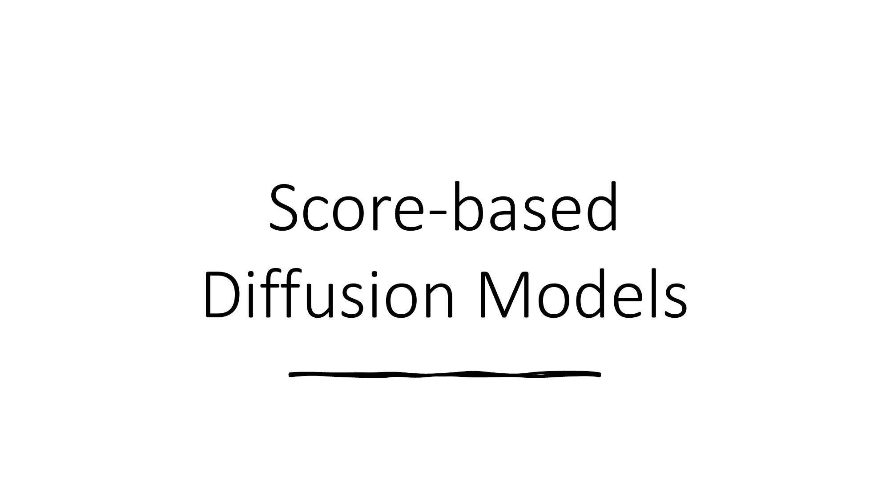

**流程**：
1. **编码器** $\mathcal{E}$：将图片压缩到低维潜空间 $z = \mathcal{E}(x)$
2. **扩散模型**：在潜空间 $z$ 上训练
3. **解码器** $\mathcal{D}$：将生成的潜变量解码回图片 $\hat{x} = \mathcal{D}(\hat{z})$

**优点**：
- 潜空间维度远小于像素空间（如 512x512x3 → 64x64x4），计算量大幅减少
- 自编码器捕获了高频细节，扩散模型只需关注语义结构

```python
# Stable Diffusion 的使用示例（使用 diffusers 库）
from diffusers import StableDiffusionPipeline
import torch

# 加载模型
pipe = StableDiffusionPipeline.from_pretrained(
    "runwayml/stable-diffusion-v1-5",
    torch_dtype=torch.float16
).to("cuda")

# 文生图
prompt = "a photo of a cute cat sitting on a sofa, high quality, 4k"
image = pipe(
    prompt,
    num_inference_steps=50,      # 采样步数
    guidance_scale=7.5,           # CFG 强度
).images[0]

image.save("cat.png")
```

### 7.2 DALL-E 2 & 3：文生图

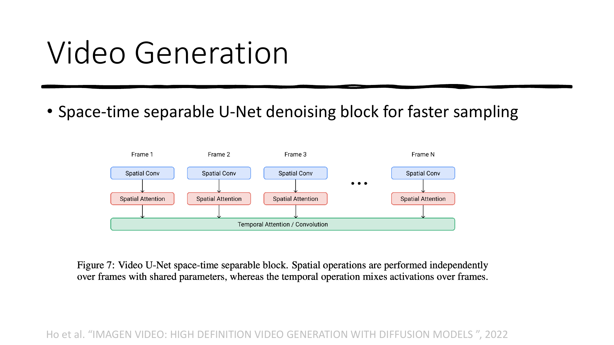

**DALL-E 2 架构**（三阶段）：
1. **CLIP**：学习文本-图片的对齐表示
2. **Prior**：从文本 embedding 生成图片 embedding → $p(z_i | y)$
3. **Decoder**：从图片 embedding 生成图片 → $p(x | z_i, y)$（级联扩散模型：64→256→1024）

**DALL-E 3 的改进**：用合成的详细描述替换简短标注，大幅提升文本对齐度。

### 7.3 SDEdit：图像编辑

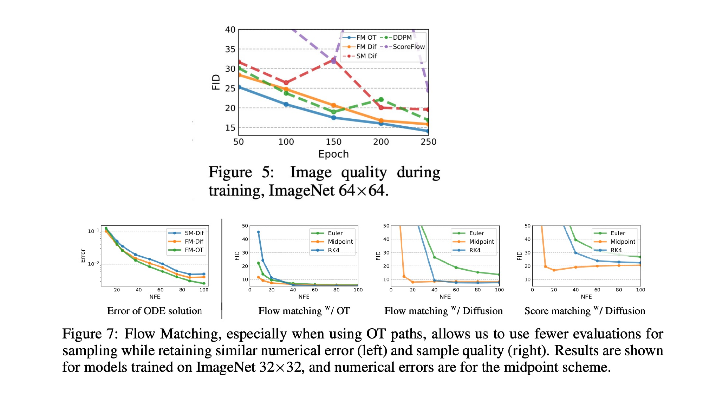

**原理**非常直觉：
1. 给一幅引导图（比如涂鸦）加噪到某个中间时间步 $t_0$
2. 然后从 $t_0$ 开始反向去噪

**加噪程度 $t_0$ 的权衡**：
- $t_0$ 大 → 去噪更彻底 → 生成更逼真但可能偏离引导图
- $t_0$ 小 → 保留更多引导信息 → 更忠实但可能不够自然

### 7.4 ControlNet：可控生成

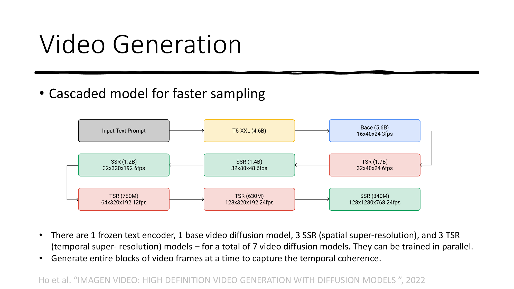

ControlNet 通过复制一份 U-Net 编码器作为条件分支，实现对生成过程的精确控制：
- 输入**边缘图** → 生成匹配边缘的真实图片
- 输入**深度图** → 生成匹配深度的真实图片
- 输入**姿态图** → 生成匹配姿态的真实图片

### 7.5 SORA & Diffusion Transformer：视频生成

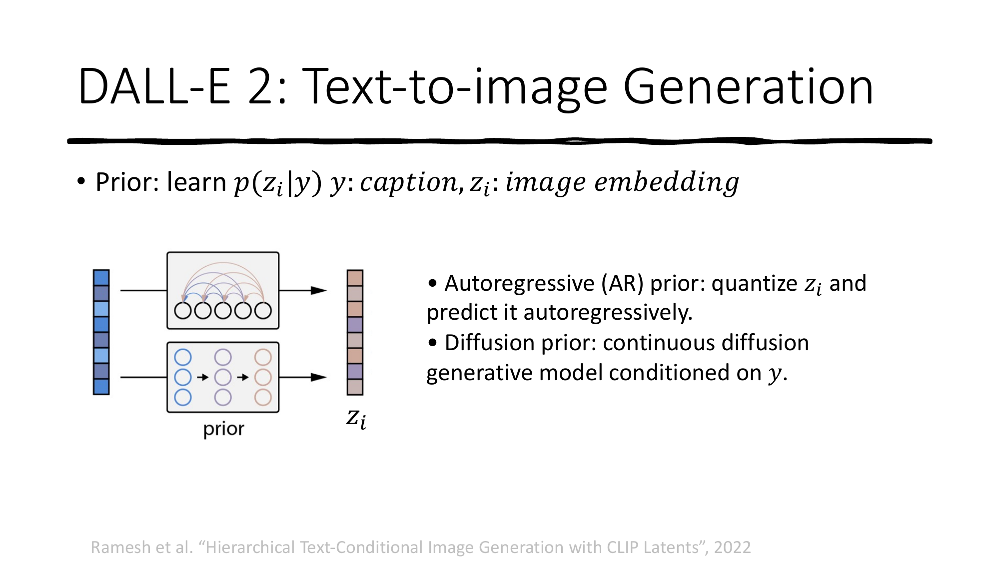

**SORA 的核心架构**：
1. 将视频压缩为低维潜空间（时空编码器）
2. 将潜表示分解为**时空 patch**（类似 ViT 的 token）
3. 使用 **Diffusion Transformer (DiT)** 做去噪

**DiT 的关键发现**：更大的模型 + 更多的计算 = 更好的生成质量（Scaling Law）

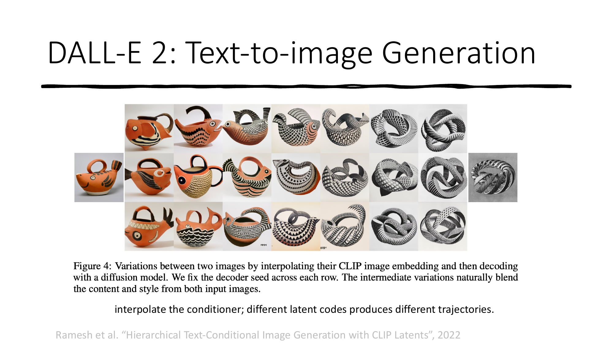

### 7.6 AlphaFold 3：蛋白质结构预测

**AlphaFold 3 将扩散模型用于蛋白质 3D 结构生成**——与生成图片类似，直接"生成"蛋白质的原子坐标！

这展示了扩散模型远超图像生成的通用性：任何从噪声到结构化数据的映射问题，都可以用扩散/流匹配来解决。

---

## 8. 总结与学习路线图

### 核心知识框架

```
生成模型
├── DDPM（离散时间扩散）
│   ├── 前向过程：加噪声（固定）
│   ├── 反向过程：去噪声（学习）
│   ├── 训练目标：预测噪声 ε
│   └── 架构：U-Net + 时间步编码
│
├── Score-Based / SDE（连续时间扩散）
│   ├── Score Function: ∇_x log p(x)
│   ├── Denoising Score Matching
│   ├── 前向/反向 SDE
│   └── Langevin 动力学采样
│
├── Diffusion ODE（确定性采样）
│   ├── Probability Flow ODE
│   ├── DDIM（1阶求解器）
│   └── DPM-Solver（高阶求解器）
│
└── Flow Matching（流匹配）
    ├── 条件流匹配 (CFM)
    ├── OT 路径（直线插值）
    └── 训练：回归向量场
```

### 推荐学习路线

| 阶段 | 内容 | 资源 |
|------|------|------|
| **入门** | 理解 DDPM 加噪/去噪直觉 | 本教程第 2 章 |
| **代码实践** | 在 MNIST/CIFAR-10 上实现 DDPM | 本教程代码 |
| **理论深入** | Score-Based 模型、SDE 框架 | Song Yang 的博客 |
| **工程应用** | 使用 HuggingFace Diffusers 库 | diffusers 官方文档 |
| **前沿** | Flow Matching、DiT、Stable Diffusion 3 | 本教程第 5、7 章 |

### 关键论文列表

1. **DDPM**: Ho et al., *Denoising Diffusion Probabilistic Models*, NeurIPS 2020
2. **Improved DDPM**: Nichol et al., *Improved Denoising Diffusion Probabilistic Models*, ICML 2021
3. **Score SDE**: Song et al., *Score-Based Generative Modeling through SDEs*, ICLR 2021
4. **DDIM**: Song et al., *Denoising Diffusion Implicit Models*, ICLR 2021
5. **Latent Diffusion**: Rombach et al., *High-Resolution Image Synthesis with Latent Diffusion Models*, CVPR 2022
6. **Flow Matching**: Lipman et al., *Flow Matching for Generative Modeling*, ICLR 2023
7. **DiT**: Peebles et al., *Scalable Diffusion Models with Transformers*, ICCV 2023
8. **Stable Diffusion 3**: Esser et al., *Scaling Rectified Flow Transformers for High-Resolution Image Synthesis*, 2024

---

> **提示**：如果你想动手实践，推荐从 HuggingFace 的 [diffusers](https://github.com/huggingface/diffusers) 库开始，它提供了所有主流扩散模型的预训练权重和推理管线。
